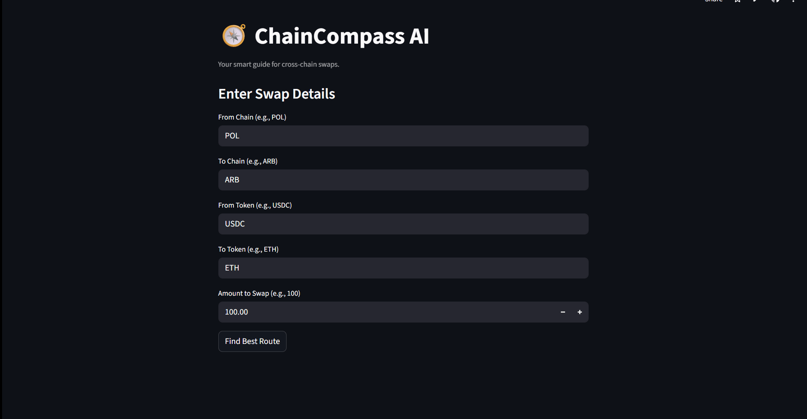

🧭 ChainCompass AI
An AI-powered assistant to find the best cross-chain swap routes, making DeFi more accessible. Built for the DeFiTimez Multichain Mayhem Hackathon.

🚀 Live Demo
You can try the live application here: https://chaincompass-ai-theno1explorer.streamlit.app/

(Note: The backend is hosted on Render's free tier and may take 30-60 seconds to "wake up" on the first request.)

🎬 Demo GIF

📖 About The Project
ChainCompass AI solves the problem of complexity in Decentralized Finance (DeFi). Finding the best route to swap tokens across different blockchains is a confusing and risky process for most users. This application provides a simple, intuitive interface where a user can define their desired swap. The backend then queries the LI.FI aggregation API to find the optimal route based on cost and speed. Finally, the complex data is summarized into a simple, human-readable recommendation using a Large Language Model (LLM) powered by LangChain and OpenAI.

🛠️ Tech Stack
Backend: FastAPI, Uvicorn

Frontend: Streamlit

AI: LangChain, OpenAI (gpt-4o-mini)

Data Source: LI.FI API

Deployment:

Backend on Render

Frontend on Streamlit Community Cloud

⚙️ Running Locally
To run this project on your own machine:

Clone the repository:

git clone [https://github.com/THENO1EXPLORER/ChainCompass-AI.git](https://github.com/THENO1EXPLORER/ChainCompass-AI.git)
cd ChainCompass-AI

Create and activate a virtual environment:

python -m venv .venv
source .venv/Scripts/activate

Install dependencies:

pip install -r requirements.txt

Create a .env file in the root directory and add your secret API keys:

OPENAI_API_KEY="sk-..."
LIFI_API_KEY="..."

Run the servers in two separate terminals from the root directory:

Terminal 1 (Backend): uvicorn main:app --reload

Terminal 2 (Frontend): streamlit run app.py